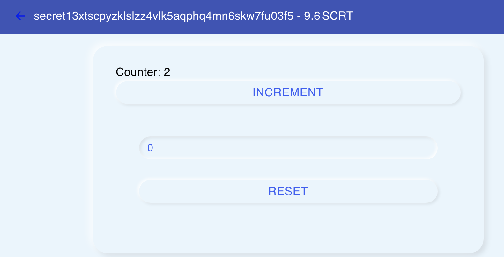

# Secret Counter

This is a simple secret contract and a React interface, built by following the [Secret Network contracts guide](https://github.com/enigmampc/enigma-blockchain-contracts-guide)

### Start the network
```bash
# Also starts nginx to proxy requests to the api server
docker-compose up
```

### Start the rest-server so we can query the network
```bash
# in a new terminal
docker-compose exec secretdev \
  secretcli rest-server \
  --node tcp://localhost:26657 \
  --trust-node \
  --laddr tcp://0.0.0.0:1317
```

### Start the faucet, to fund burner wallets
```bash
git clone https://github.com/enigmampc/SecretNetwork/
# check out develop branch for now
git checkout develop
cd SecretNetwork/cosmwasm-js
# build the JS components
yarn install
yarn build
# start the faucet
cd packages/faucet
yarn dev-start
```

### Fund the faucet holder (if this is different from your test account)
```bash
docker-compose exec secretdev \
  secretcli tx send \
  a secret1pkptre7fdkl6gfrzlesjjvhxhlc3r4gmenn2dx \
  100000000000uscrt --from a \
  --keyring-backend test --yes
```

### Deploy the contract
```bash
cd client
node scripts/deploy_counter.js
```

### Start the app
```bash
cd client
yarn start:local
```

### If it all works so far, you can play with the counter.


### todo SecretJS / privacy
